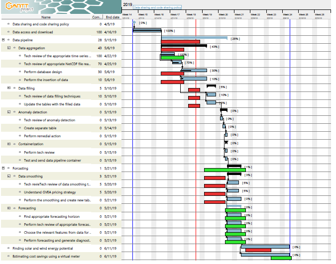

# demand_acep
> Python package to help reduce demand charges.

[](https://travis-ci.com/chintanp/demand_acep) [](https://coveralls.io/github/chintanp/demand_acep?branch=master) [](https://demand-acep.readthedocs.io/en/latest/?badge=latest) <a href="https://github.com/ambv/black"></a> [](https://mybinder.org/v2/gh/chintanp/demand_acep/master)


One to two paragraph statement about your product and what it does.

 (logo or some sort of image)

## Installation

Linux:

```sh
pip install demand_acep
```


## Usage example

A few motivating and useful examples of how your product can be used. Spice this up with code blocks and potentially more screenshots.

_For more examples and usage, please refer to the [Wiki][wiki]._

## Development setup

Describe how to install all development dependencies and how to run an automated test-suite of some kind. Potentially do this for multiple platforms.

```sh
make install
npm test
```

## Release History

* 0.2.1
    * CHANGE: Update docs (module code remains unchanged)
* 0.2.0
    * CHANGE: Remove `setDefaultXYZ()`
    * ADD: Add `init()`
* 0.1.1
    * FIX: Crash when calling `baz()` (Thanks @GenerousContributorName!)
* 0.1.0
    * The first proper release
    * CHANGE: Rename `foo()` to `bar()`
* 0.0.1
    * Work in progress

## Meta

Chintan Pathak, Yohan Min, Atinuke Ademola-Idowu - cp84@uw.edu, min25@uw.edu, aidowu@uw.edu.
Distributed under the MIT license. See ``LICENSE`` for more information.


## Contributing

1. Fork it (<https://github.com/yourname/yourproject/fork>)
2. Create your feature branch (`git checkout -b feature/fooBar`)
3. Commit your changes (`git commit -am 'Add some fooBar'`)
4. Push to the branch (`git push origin feature/fooBar`)
5. Create a new Pull Request


## Project progress
The Gantt chart below shows our progress. It is regularly updated. 


