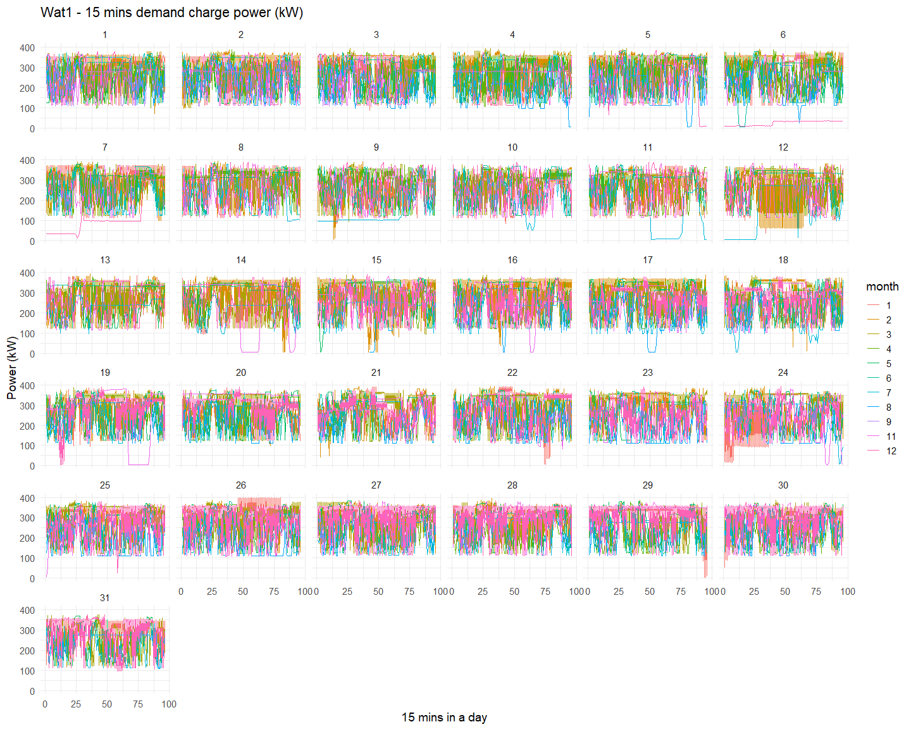
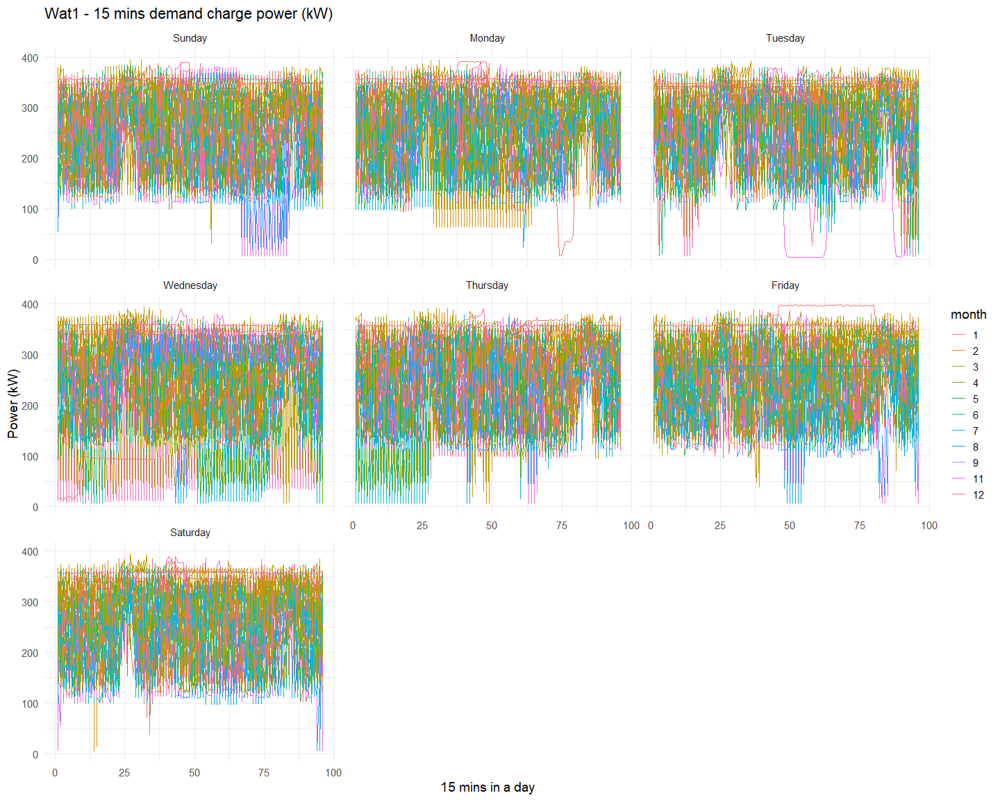
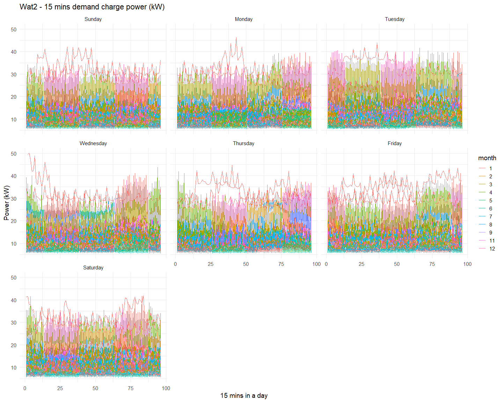
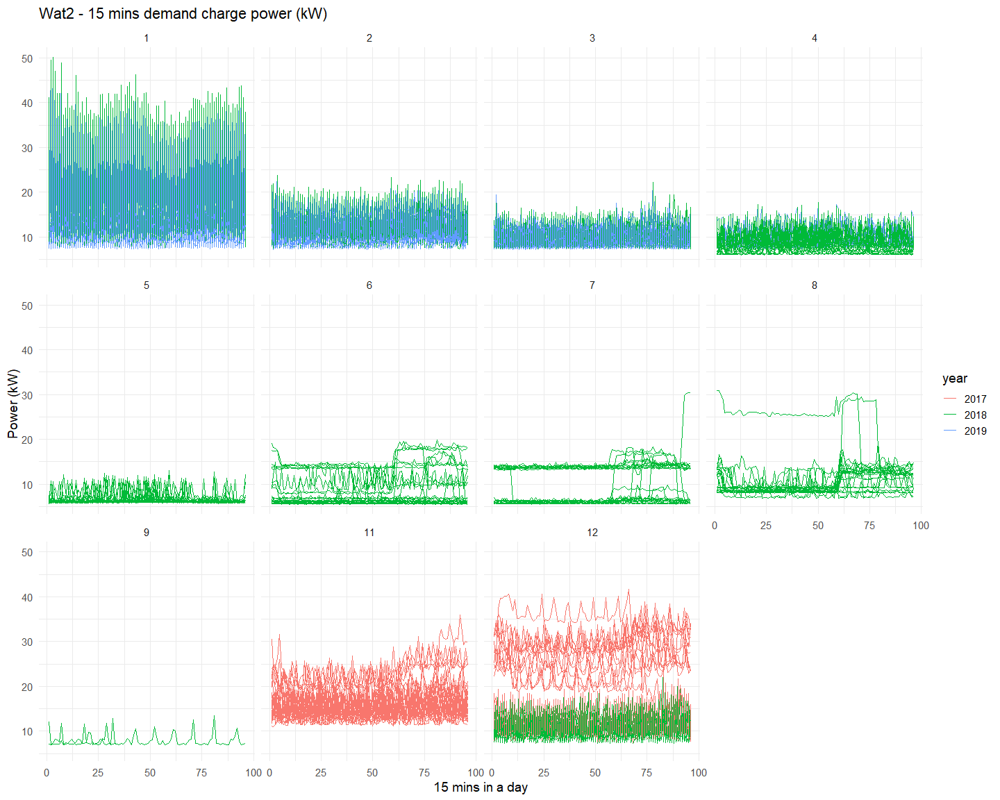
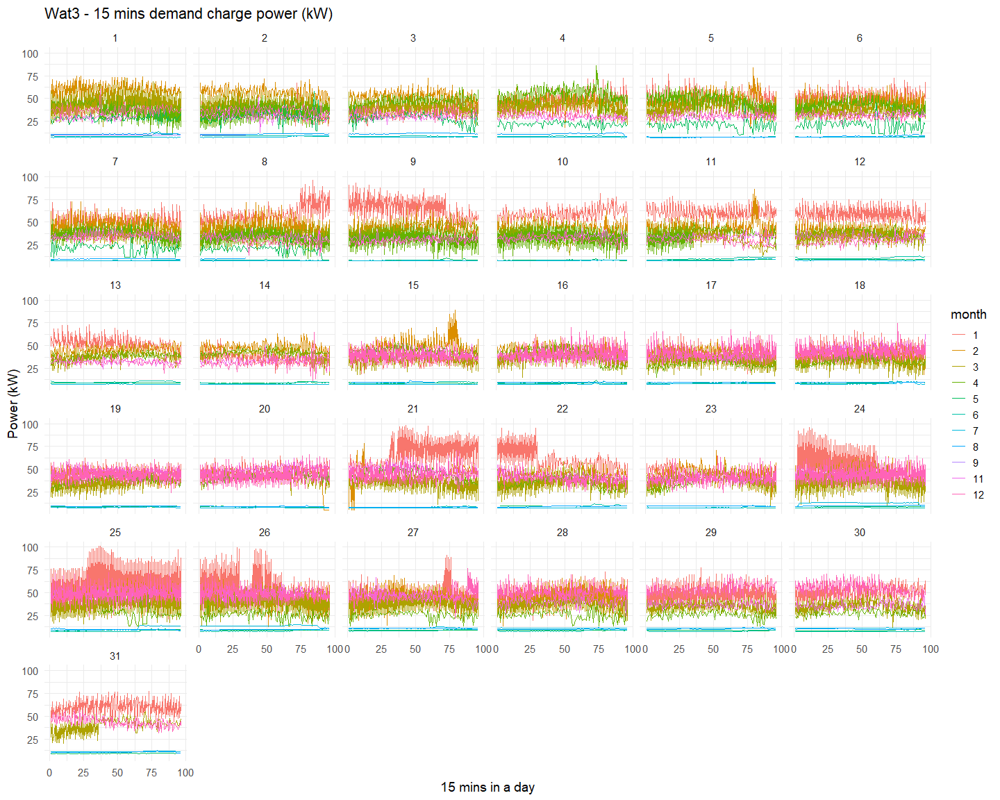

For each meter (PQ, Wat1, Wat2, and Wat3), there are four plots showing the power (kW) trends per years, months, weekdays and days to help comparing the trends (Nov. 2017 to Apr. 2019)

* Power (kW) trend of a day for days (Day 1 to Day 31) per month 
* Power (kW) trend of a day for weekdays (Sunday to Saturday) per month
* Power (kW) trend of a day for months (Jan. to Dec.) per year
* Power (kW) trend of a month for months (Jan. to Dec.) per year

# PQ

## Power (kW) trend of a day for days (Day 1 to Day 31) per month 

<!-- -->

## Power (kW) trend of a day for weekdays (Sunday to Saturday) per month

<!-- -->

## Power (kW) trend of a day for months (Jan. to Dec.) per year

<!-- -->

## Power (kW) trend of a month for months (Jan. to Dec.) per year

<!-- -->

# Wat 1

## Power (kW) trend of a day for days (Day 1 to Day 31) per month 

<!-- -->

## Power (kW) trend of a day for weekdays (Sunday to Saturday) per month

<!-- -->

## Power (kW) trend of a day for months (Jan. to Dec.) per year

<!-- -->

## Power (kW) trend of a month for months (Jan. to Dec.) per year

<!-- -->

# Wat 2

## Power (kW) trend of a day for days (Day 1 to Day 31) per month 

<!-- -->

## Power (kW) trend of a day for weekdays (Sunday to Saturday) per month

<!-- -->

## Power (kW) trend of a day for months (Jan. to Dec.) per year

<!-- -->

## Power (kW) trend of a month for months (Jan. to Dec.) per year

<!-- -->

# Wat 3

## Power (kW) trend of a day for days (Day 1 to Day 31) per month 

<!-- -->

## Power (kW) trend of a day for weekdays (Sunday to Saturday) per month

<!-- -->

## Power (kW) trend of a day for months (Jan. to Dec.) per year

<!-- -->

## Power (kW) trend of a month for months (Jan. to Dec.) per year

<!-- -->
