# Overall

<!-- --><!-- -->

```
## 
## Call:
## lm(formula = PQ ~ Wat1 + Wat2 + Wat3)
## 
## Residuals:
##     Min      1Q  Median      3Q     Max 
## -68.800 -11.841  -1.182   8.172  91.313 
## 
## Coefficients:
##              Estimate Std. Error t value Pr(>|t|)    
## (Intercept) 15.732780   0.375119  41.941  < 2e-16 ***
## Wat1         0.003926   0.001164   3.373 0.000744 ***
## Wat2         2.017510   0.015340 131.521  < 2e-16 ***
## Wat3         1.338950   0.005774 231.900  < 2e-16 ***
## ---
## Signif. codes:  0 '***' 0.001 '**' 0.01 '*' 0.05 '.' 0.1 ' ' 1
## 
## Residual standard error: 18.86 on 38259 degrees of freedom
##   (1237 observations deleted due to missingness)
## Multiple R-squared:  0.7316,	Adjusted R-squared:  0.7316 
## F-statistic: 3.476e+04 on 3 and 38259 DF,  p-value: < 2.2e-16
```


# Forecast based on day

## PQ

<!-- --><!-- --><!-- -->


## Wat1

<!-- --><!-- -->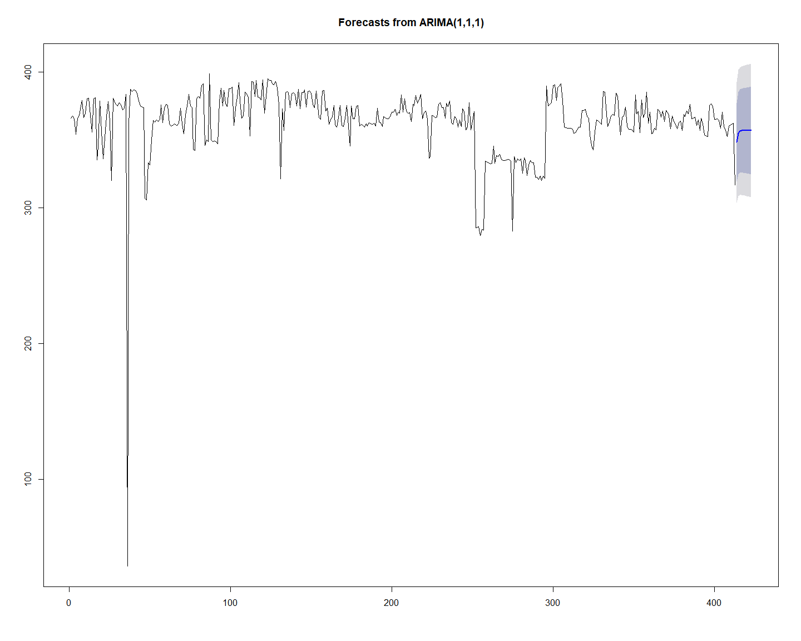<!-- -->

## Wat2

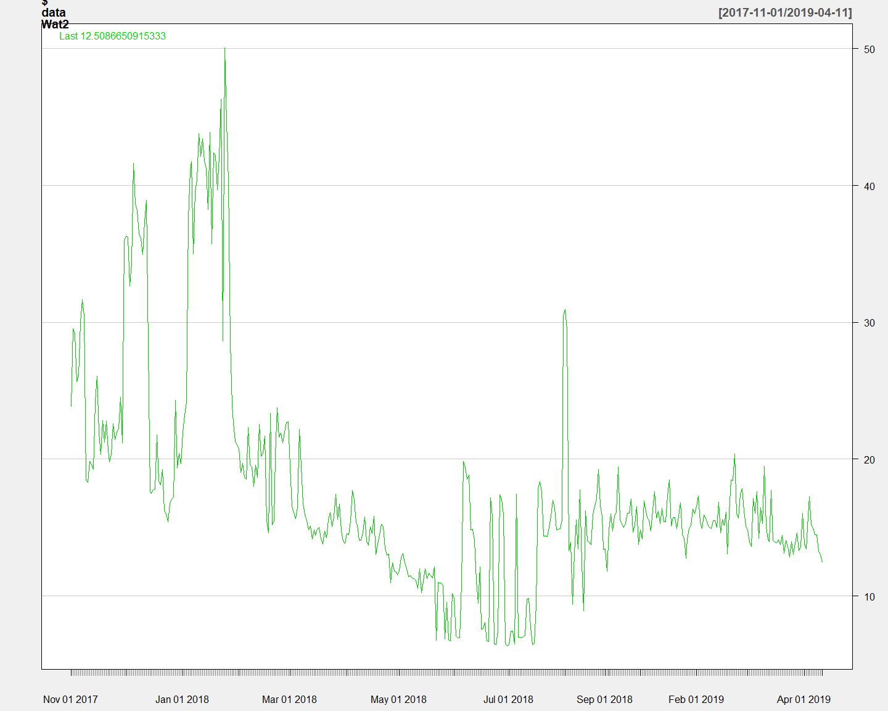<!-- -->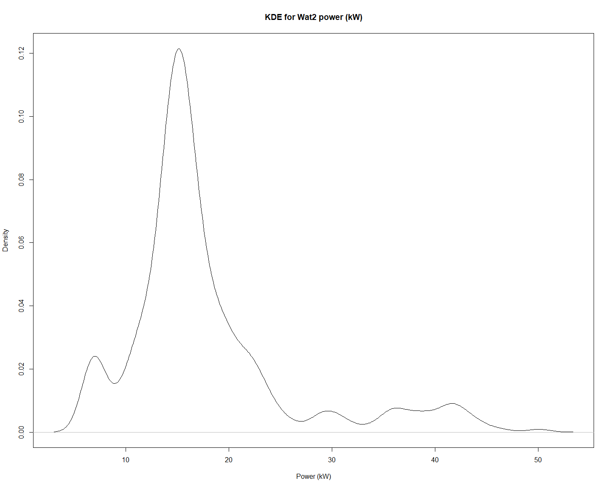<!-- --><!-- -->

## Wat3

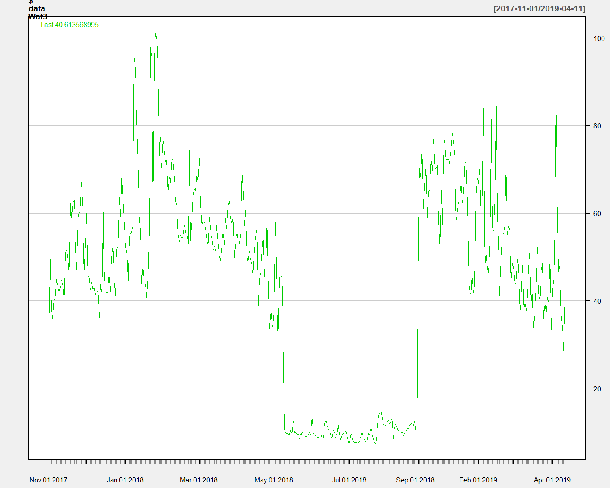<!-- -->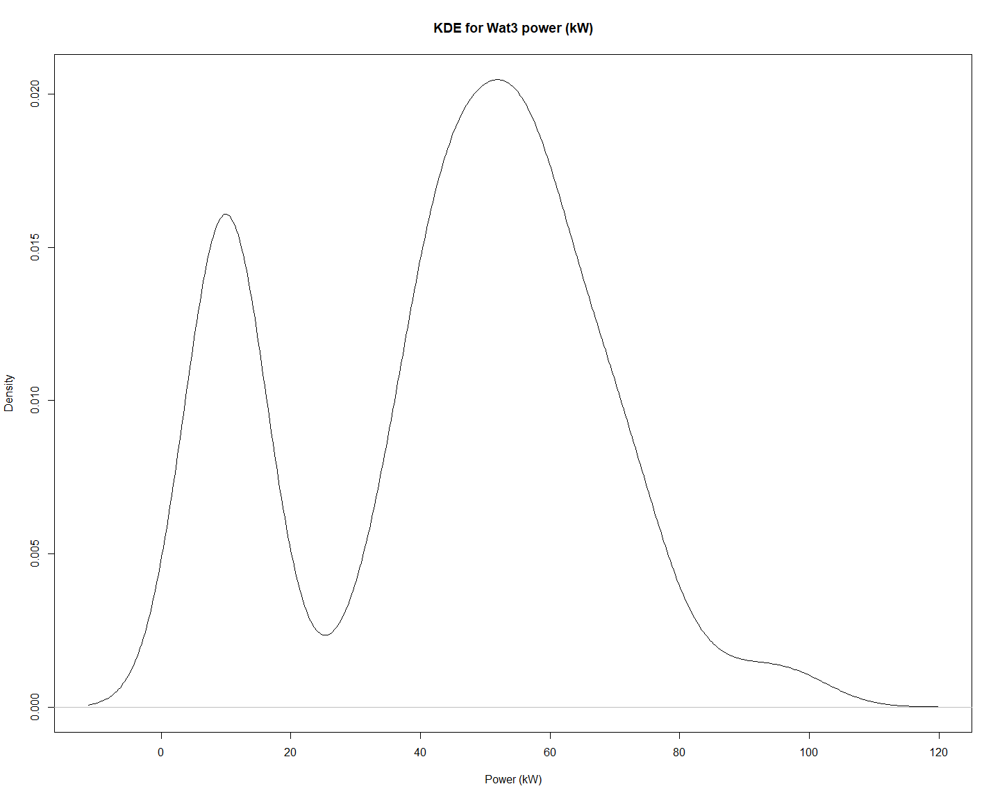<!-- -->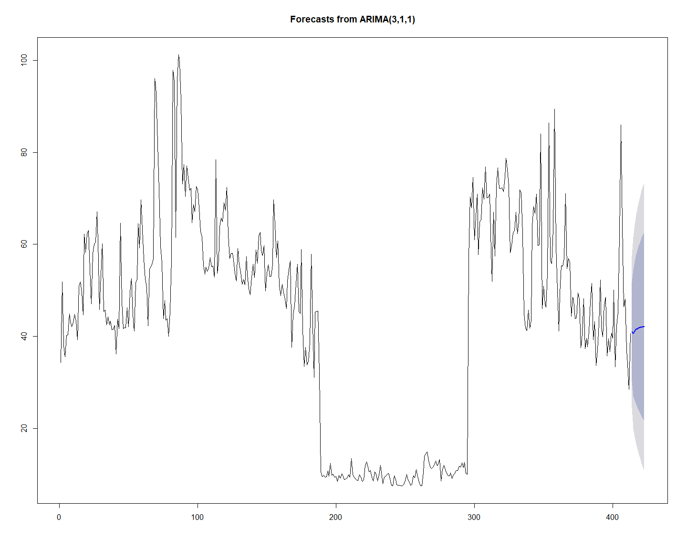<!-- -->


# Forecast based on month

## PQ

<!-- -->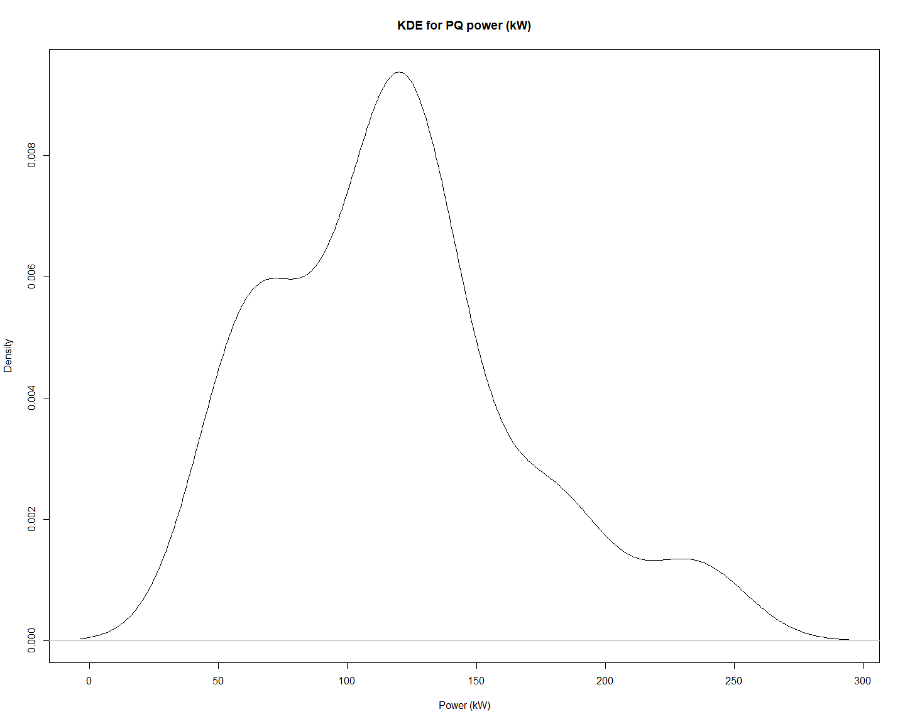<!-- --><!-- -->


## Wat1

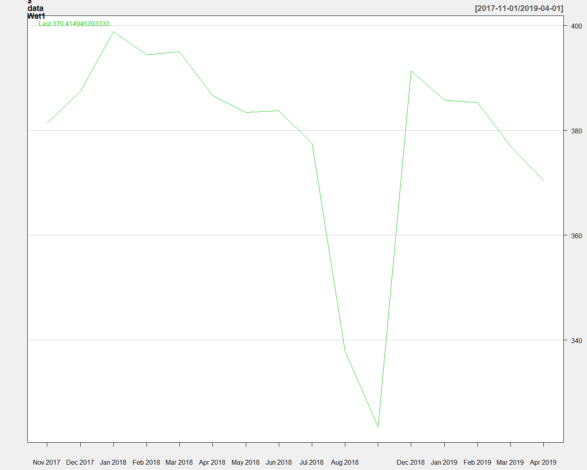<!-- --><!-- -->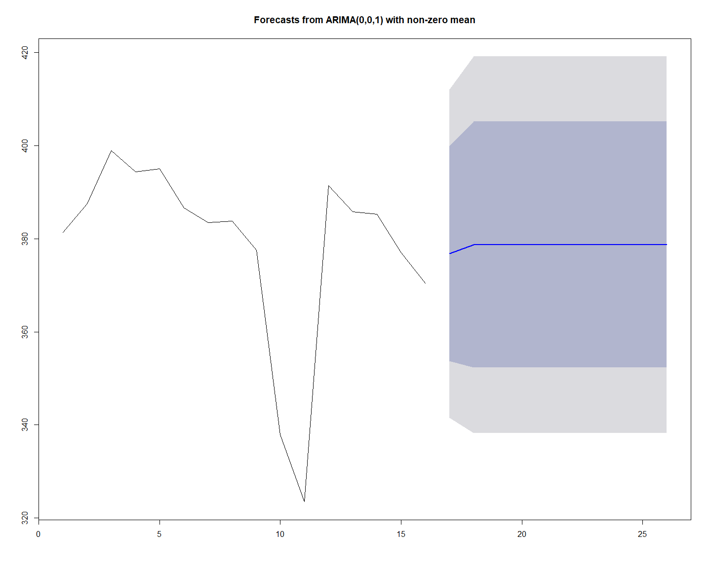<!-- -->

## Wat2

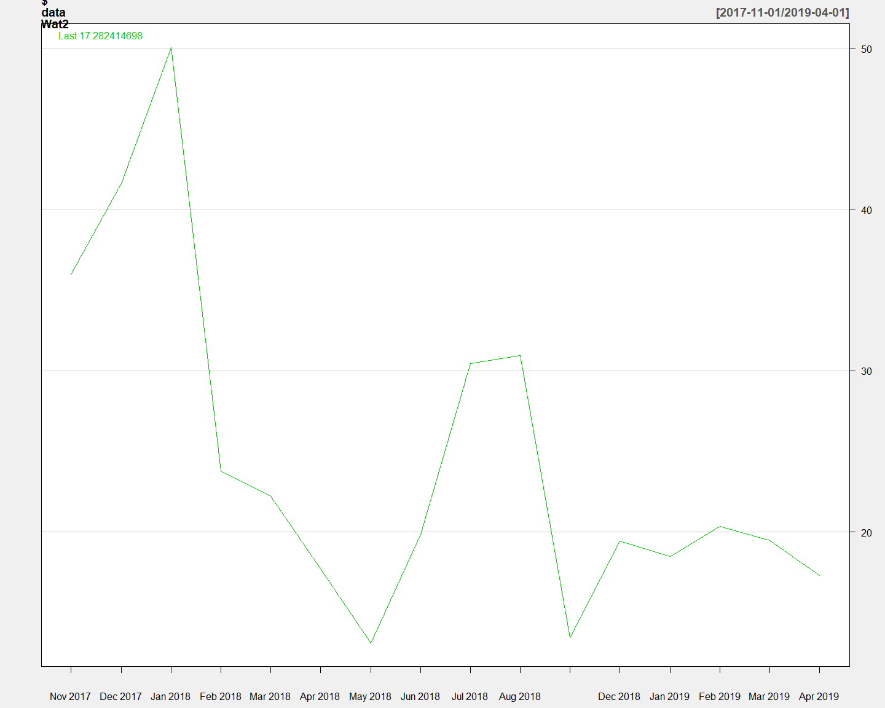<!-- -->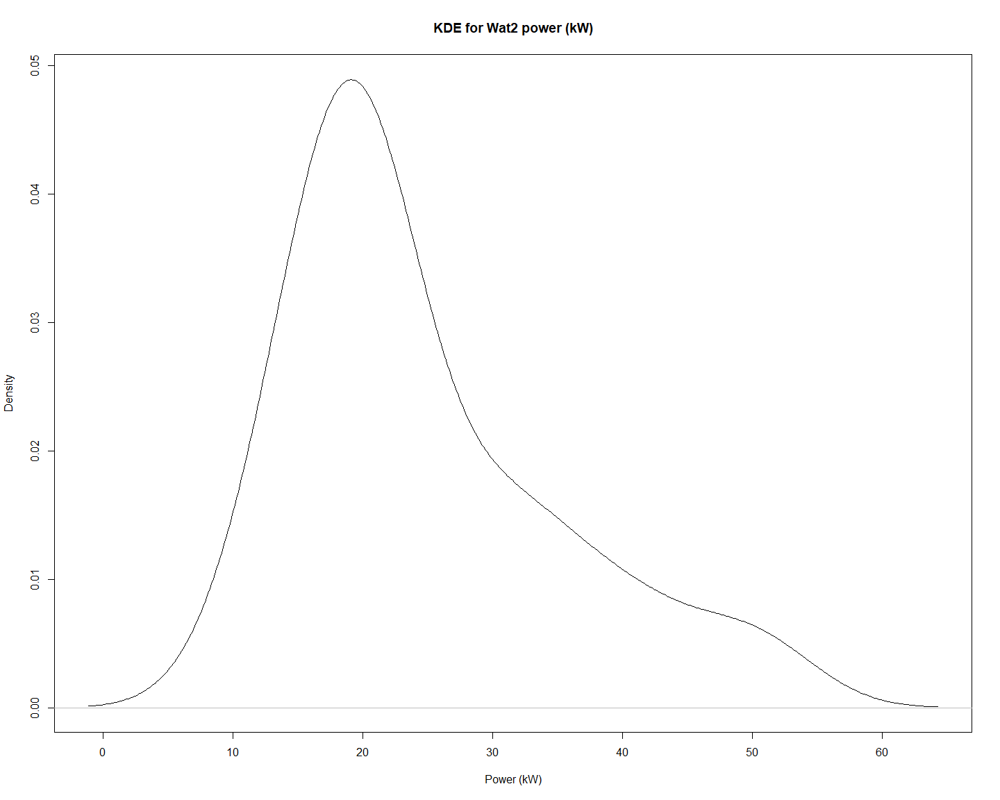<!-- -->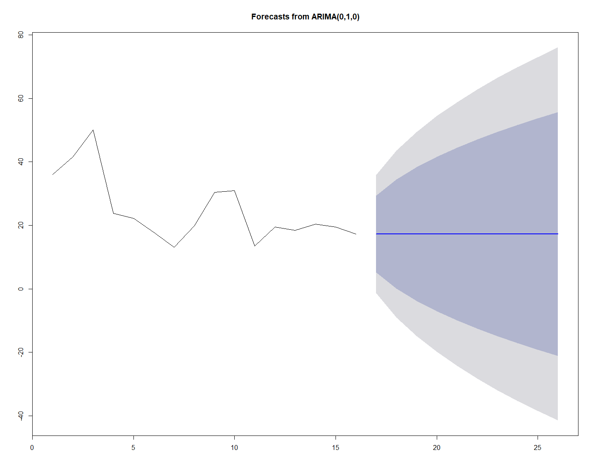<!-- -->

## Wat3

<!-- -->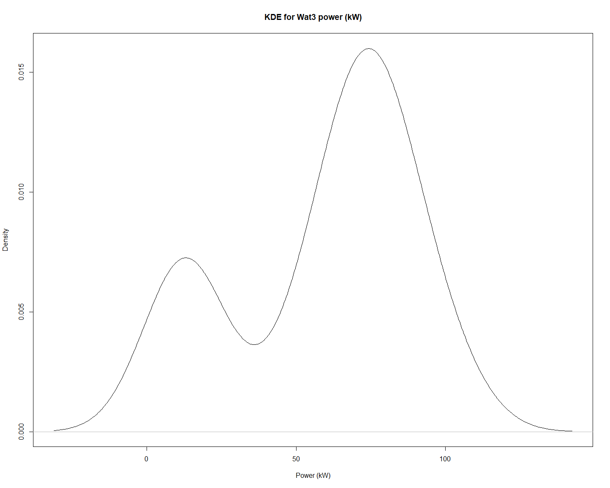<!-- --><!-- -->
