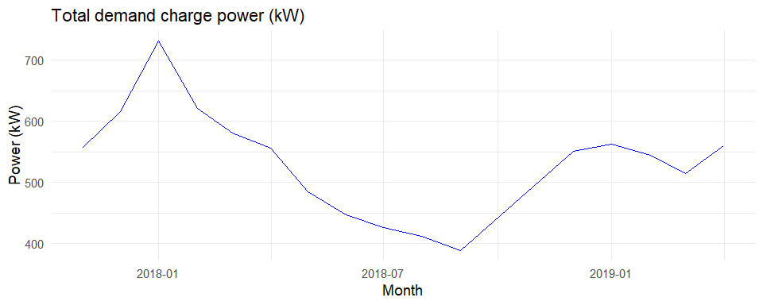
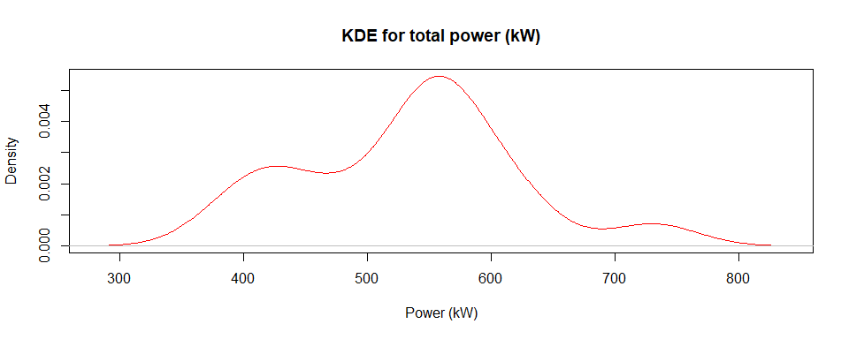
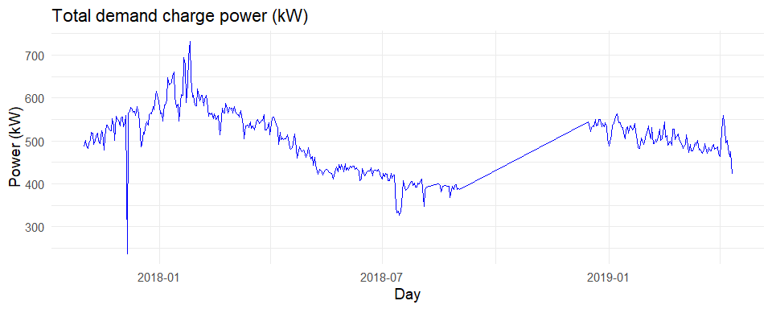
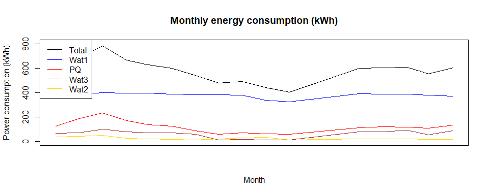
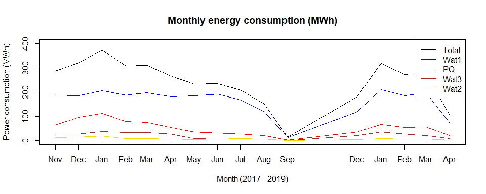

# Total aggregated power (kW) for demand charge based on month

The aggregated total power (kW) on a monthly basis will show the trend of peak demand power over the past 3 years. This will help to analyze the effect of a virtual meter by comparing the separate billing of the four meters and the aggregated billing of the virtual meter. 

Using ARIMA, the trend of aggregated meter powers were forecasted based on month, which is the billing cycle for demand charge. The power trends were plotted with maximum value of the peak power during the month because the peak power decides the billing cost.

## Montly maximum peak power(kW) trend

<!-- -->

## Density of maximum peak power (kW)

<!-- -->

## Prediction performance for the last 3 months

<!-- -->

# Forecast based on day

For the comparison, forecaste based on day, was also plotted. The range between the upper and lower bound of forecast shows narrower than the one based on month. 

## Daily maximum peak power(kW) trend

<!-- -->

## Density of maximum peak power (kW)

<!-- -->

## Prediction performance for the last 10 days

<!-- -->

