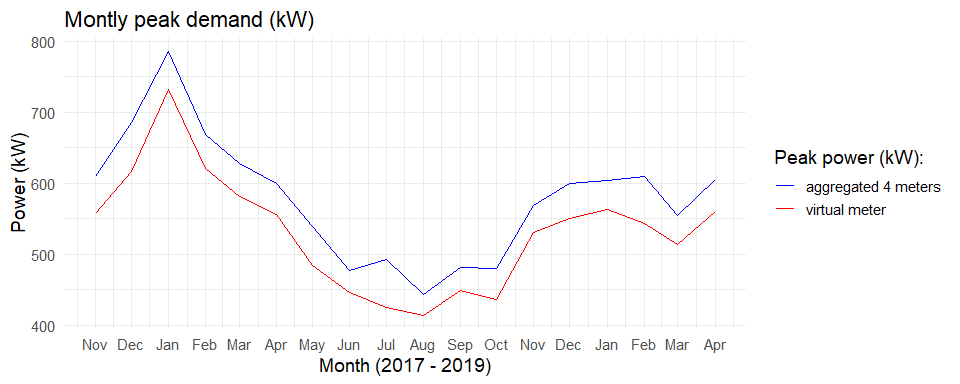
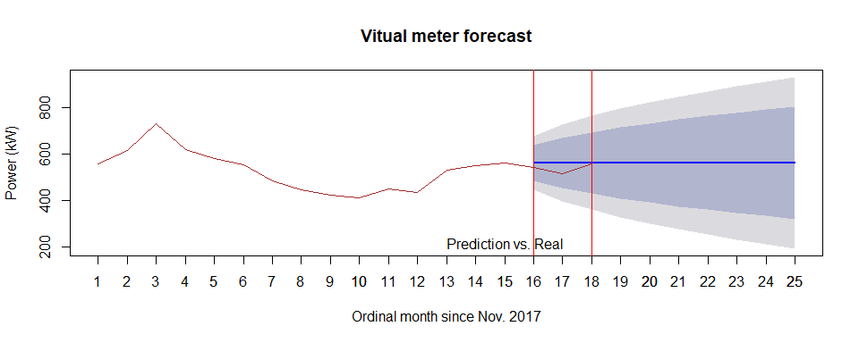
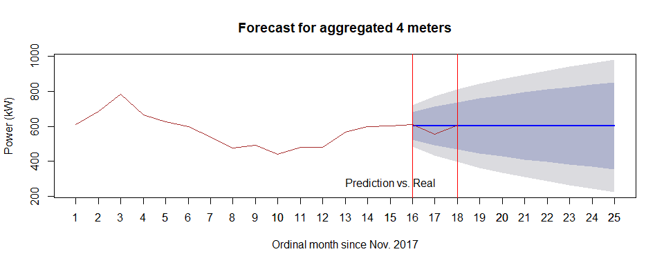
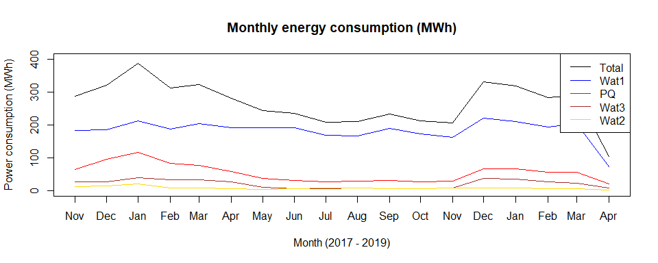
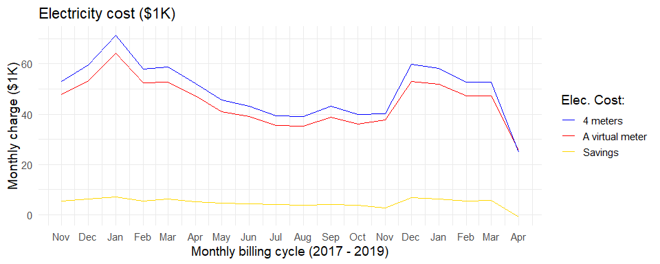
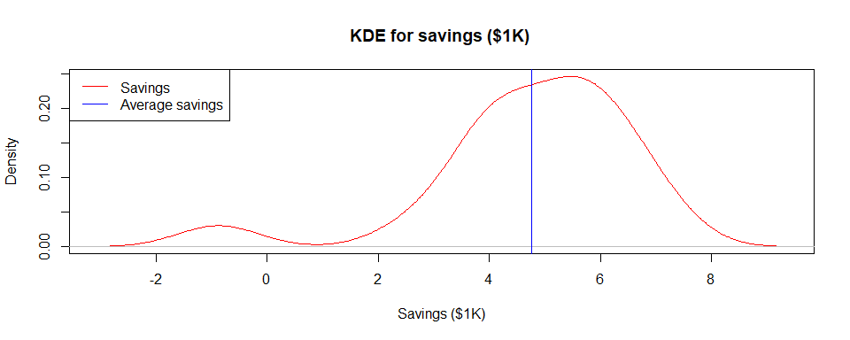

# Total aggregated power (kW) for demand charge based on month

The aggregated total power (kW) on a monthly basis will show the trend of peak demand power over the past 3 years. This will help to analyze the effect of a virtual meter by comparing the separate billing of the four meters and the aggregated billing of the virtual meter. 

Using ARIMA, the trend of aggregated meter powers were forecasted based on month, which is the billing cycle for demand charge. The power trends were plotted with maximum value of the peak power during the month because the peak power decides the billing cost.

It turns out having a virtual meter by aggregating all the power consumptions of all four meters, reduces the peak demand as shown in the Figure below. Every month has less peak demand by a virtual meter compared to summing up all the peak demand of the individual meters during a billing cycle. 

## Montly maximum peak power(kW) trend

<!-- -->

## Density of maximum peak power (kW)

The figure below shows by having a virtual meter, the peak demand density becomes lower. It shows the distribution of peak power or probability that what value of peak power (kW) is highly expected for the cases of a virtual meter scenario and the total of the individual 4 meters. It shows that having a virtual meter reduced the probability of higher peak power across months. 

<!-- -->

## Prediction performance for the last 3 months

There are slightly difference between monthly peak demand forecasts of a virtual meter and aggregated four meters. 

<!-- -->

<!-- -->

# Benefit-cost analysis of involving a virtual meter

A virtual meter could save money by aggregating all the meters resulting in a payment once during a billing cycle as opposed to several billed payments, in this case four times. On the other hand, vitual meter may lead to higher rate per unit kW for the demand charge. For example, the utility has charged `Poker flat` \$14.29 per kW for GS-2 service while GS-3 would involve \$22.89 per kW. So it is necessary to perform a benefit-cost analysis to find if saving could happen by implementing a virtual meter. 

On the other hand, GS-3 service has higher utility charge of \$0.0294 per kWh while GS-2 has \$0.06256 per kWh. The monthly power consumption for each meter and the total are shown in the figure below. Note that the energy consumption value is for each month in order since November 2017 to April 2019. 

<!-- -->

Adding customer charge and fuel & purchased power charge, which are fixed during a month, the total estimated electricity costs for the both cases (1) payments for the individual 4 meters, and (2) a payment for the virtual meter, were caculated. 

<table class="table table-striped table-hover table-condensed" style="margin-left: auto; margin-right: auto;">
<caption>Rate schedule</caption>
 <thead>
  <tr>
   <th style="text-align:left;"> Service Type </th>
   <th style="text-align:right;"> Customer Charge [$/month] </th>
   <th style="text-align:right;"> Utility Charge [$/kWh] </th>
   <th style="text-align:right;"> Fuel &amp; Purchased Power Charge [$/kWh] </th>
   <th style="text-align:right;"> Demand Charge [$/kW] </th>
  </tr>
 </thead>
<tbody>
  <tr>
   <td style="text-align:left;"> Residential </td>
   <td style="text-align:right;"> 17.5 </td>
   <td style="text-align:right;"> 0.11631 </td>
   <td style="text-align:right;"> 0.09207 </td>
   <td style="text-align:right;"> 0.00 </td>
  </tr>
  <tr>
   <td style="text-align:left;"> GS-1 </td>
   <td style="text-align:right;"> 20.0 </td>
   <td style="text-align:right;"> 0.11528 </td>
   <td style="text-align:right;"> 0.09207 </td>
   <td style="text-align:right;"> 0.00 </td>
  </tr>
  <tr>
   <td style="text-align:left;"> GS-2(S) </td>
   <td style="text-align:right;"> 30.0 </td>
   <td style="text-align:right;"> 0.06256 </td>
   <td style="text-align:right;"> 0.09207 </td>
   <td style="text-align:right;"> 14.29 </td>
  </tr>
  <tr>
   <td style="text-align:left;"> GS-2(P) </td>
   <td style="text-align:right;"> 30.0 </td>
   <td style="text-align:right;"> 0.06256 </td>
   <td style="text-align:right;"> 0.09207 </td>
   <td style="text-align:right;"> 14.29 </td>
  </tr>
  <tr>
   <td style="text-align:left;"> GS-3 </td>
   <td style="text-align:right;"> 295.0 </td>
   <td style="text-align:right;"> 0.02940 </td>
   <td style="text-align:right;"> 0.09207 </td>
   <td style="text-align:right;"> 22.86 </td>
  </tr>
</tbody>
</table>

It turns out aggregating all the meters by a virtual meter ends up with paying less with less peak power during a billing cycle as opposed to the aggregation of the peak power of the individual four meters. Note that a specific month has a negative saving meaning that the virtual meter option loses money. It is interesting to see that it would be more beneficial to have a virtual meter when higher energy consumption (kWh) is expected leading to more profitable option. The highest saving would be \$7169.3 on 2018-01 and the lowest, \$-877.89 on 2019-04, where the negative saving is due to the lower energy consumption on the month resulting from data missing. 

<!-- -->

The saving distribution is as below showing the most savings would occur between \$4,000 to \$7,000 a month. 

<!-- -->

The estimated average montly saving would be \$5356.17 due to its skewness to left. So the conclusion is having a vurtaul meter is viable and saving money by reducing the billing. 

* Note that the last month in the data, which is April of 2019, has only 10 days data available so the values are relatively lower than other months. 

* There were missing months such as November and December of 2018, and missing days specially in September, 2018 so data filling technique was performed with the fact that this doesn't invole bias result. 

* Nontheless, for the purpose of comparison of the both cases (a virtual meter, and 4 meters), missing or filling data won't be an issue as it applies the same to the both cases and still make the cases comparable.

