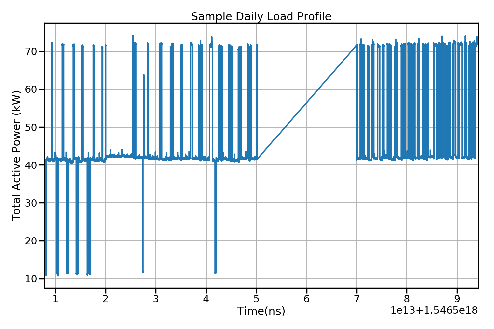
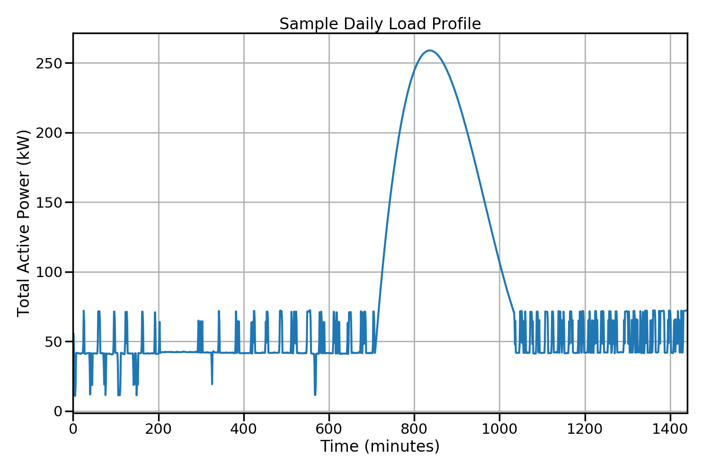
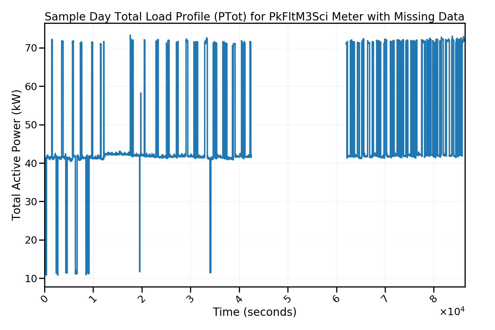
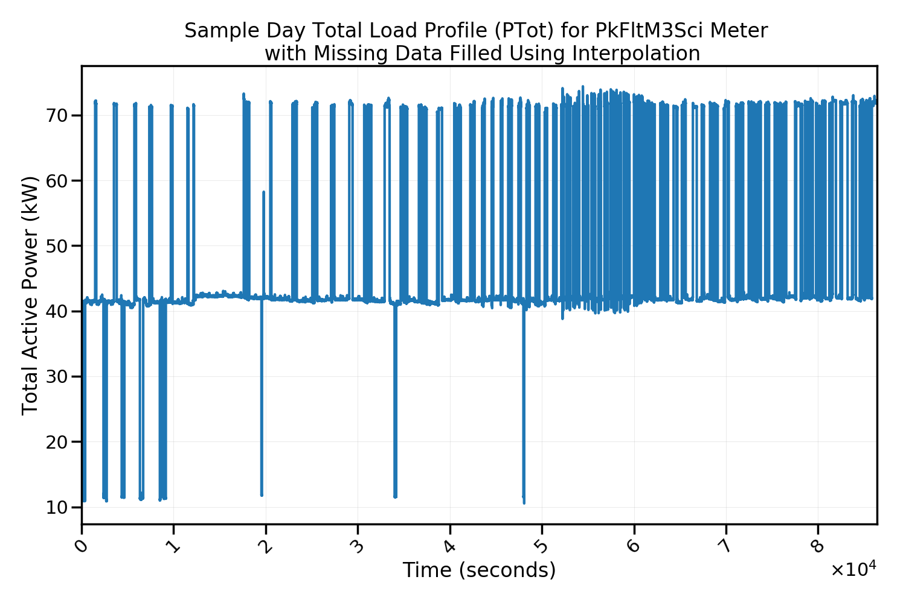
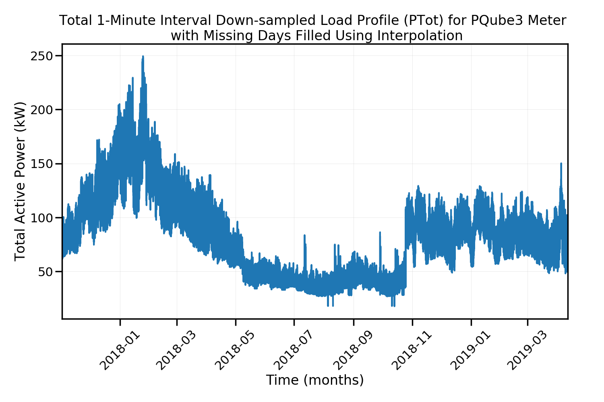

.. _data_imputation:

=======================
Data Imputation
=======================
Data Imputation is a process by which missing data points are filled. The ACEP measurement data is in the form of a time series, with missing data points ranging from seconds to months. Several python modules for data imputation were reviewed but none could cater to the specific demands of the ACEP time series data. In particular, using the linear, quadratic or cubic 1-d interpolation function `interp1d()`_ from the scipy module give unsatisfactory results as shown below:

**Linear Interpolation.**

**Spline Interpolation.**

This is because the function `interp1d()`_ function uses the a single data point before and after the missing data points to interpolate. To fix this, a new interpolation function `data_impute()`_ was created to extend the capabilities of the `interp1d()`_ function by selecting multiple data points before and after the missing data points with the number of data points selection equal to the number of missing data points. The `data_impute()`_ function also handles edge cases such as when the number of data points before and after the missing data points is less than the number of missing data points. In this case, the function selects the available data points.

Depending on the duration of the missing data points, the `data_impute()`_ can be used as it is or coupled with other functions as described below.

Short Duration Missing Data Points 
=======
Missing data points are termed short duration if the number of consecutive missing points sums up to less than 24hrs. The pandas DataFrame containing this data can be passed to the interpolation function `data_impute()`_  for filling. 

An example of a short duration missing data imputation for a sample is shown in the jupyter notebook `test_data_impute.ipynb`_ and the results displayed in the figures below. In this example, about 3 hrs of data is missing.

**Before Filling**

**After Filling**

Long Duration Missing Data Points
=======
When the number of consecutive missing data points sum up to more than 24 hrs, that is, ranges from days to months, it is termed a long duration missing data. This scenario is handled a bit differently from the short duration missing data as the data imputation is performed after the data has been inserted into the database. The reason for this is that when processing the measurement data through the data pipeline, the days with the missing data is unknown.

The function `long_missing_data_prep()`_ is used to pre-process the full data downloaded from the time series data base by inserting the missing data points time index and assigning a value of NaN. This preprocessed data can then be passed into the interpolation function `data_impute()`_  for filling.

An example of a long duration missing data imputation is shown in the jupyter notebook `test_large_missing_data.ipynb`_ and the results displayed in the figures below. In this example, he larges duration of consecutive missing points sums up to about 3 months.

**Before Filling**

.. image:: _static/total_profile_missing_correct.png
   :width: 400 px
   :align: center

**After Filling**

.. _interp1d(): https://docs.scipy.org/doc/scipy/reference/generated/scipy.interpolate.interp1d.html

.. _test_data_impute.ipynb: https://github.com/demand-consults/demand_acep/blob/master/scripts/test_data_impute.ipynb   

.. _test_large_missing_data.ipynb: https://github.com/demand-consults/demand_acep/blob/master/scripts/test_large_missing_data.ipynb 

.. _data_impute(): https://github.com/demand-consults/demand_acep/blob/36119932492f545f96e3072118b35e6a9d345e67/demand_acep/demand_acep.py#L196

.. _long_missing_data_prep(): https://github.com/demand-consults/demand_acep/blob/36119932492f545f96e3072118b35e6a9d345e67/demand_acep/demand_acep.py#L223
