# Power (kW) for demand charge correlation

These 4 meters have power (kW) correlated each other for the past 3 years. The correlations are various depending upon the comparisons. In general, power in `PQ` meter is mostly correlated with power in `Wat3`. This founding is interesting as the more correlated, the more dependency resulting in less effective to address load reduction of having a virtual meter, are expected. 

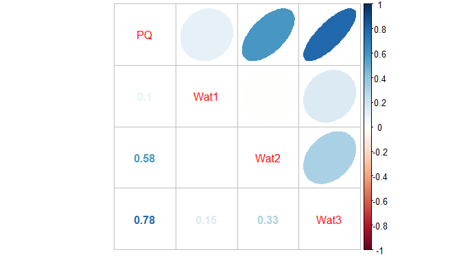<!-- -->

# Past 3 years power trends of each meter (Nov. 2017 to Apr. 2019)

Variances of power (kW) for each meter, verify the correlations found in the previous correlation plot.

<!-- -->

A regression model for power of `PQ` shows `Wat3` is the most significant followed by `Wat2` resulting in 0.72 in adjusted R-squared. They are higly correlated. 

---------------------------------------------------------------
     &nbsp;        Estimate   Std. Error   t value   Pr(>|t|)  
----------------- ---------- ------------ --------- -----------
 **(Intercept)**    15.73       0.3751      41.94        0     

    **Wat1**       0.003926    0.001164     3.373    0.0007436 

    **Wat2**        2.018      0.01534      131.5        0     

    **Wat3**        1.339      0.005774     231.9        0     
---------------------------------------------------------------

Table: Fitting linear model: PQ ~ Wat1 + Wat2 + Wat3

# Forecast based on month

Using ARIMA, power trends of each meter were forecasted based on month, which is the billing cycle for demand charge. The power trends were plotted with maximum value of the peack power during the month because the peak power decides the billing cost. 

## PQ

It was expected that power for PQ would be around 125 kW for the last 3 months and the real values for these months were 114, 107, and 131 kW respectively. 

### Montly maximum peak power(kW) trend

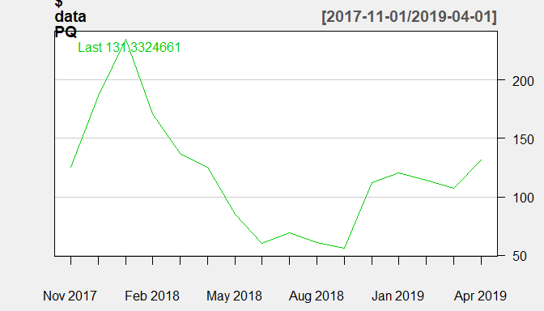<!-- -->

### Density of maximum peak power (kW)

<!-- -->

### Prediction performance for the last 3 months

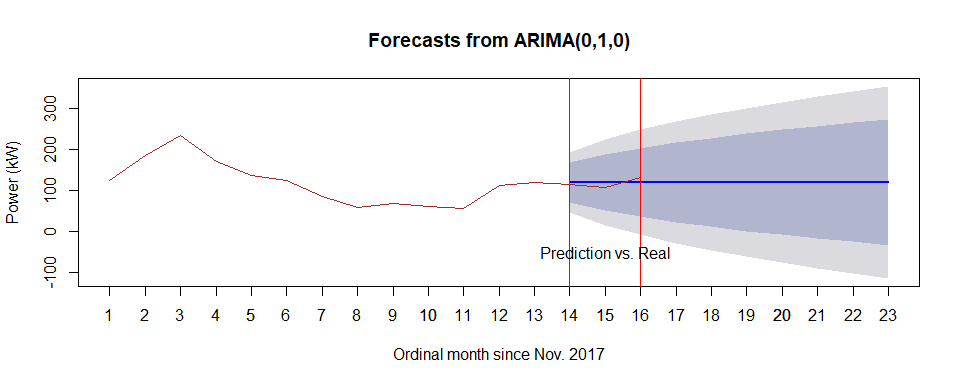<!-- -->

## Wat1

It was expected that power for Wat1 would be around 372 kW for the last 3 months and the real values for these months were 385, 377, and 370 kW respectively. 

### Montly maximum peak power(kW) trend

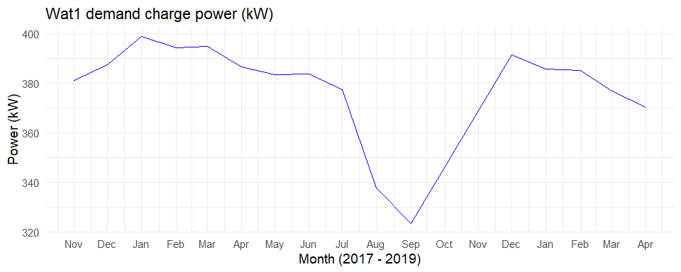<!-- -->

### Density of maximum peak power (kW)

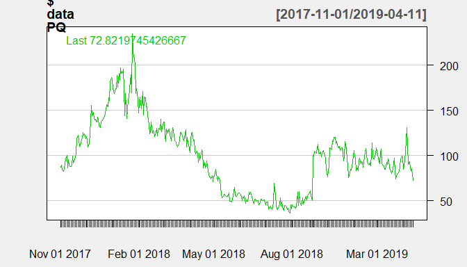<!-- -->

### Prediction performance for the last 3 months

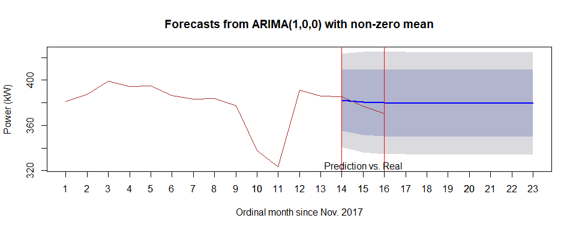<!-- -->

## Wat2

It was expected that power for Wat2 would be around 18 kW for the last 3 months and the real values for these months were 20, 19, and 17 kW respectively. 

### Montly maximum peak power(kW) trend

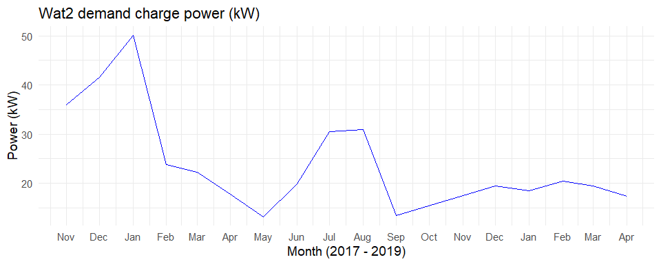<!-- -->

### Density of maximum peak power (kW)

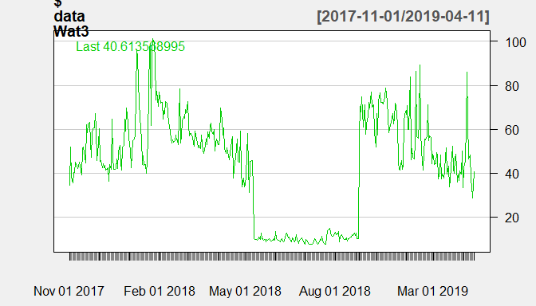<!-- -->

### Prediction performance for the last 3 months

<!-- -->

## Wat3

It was expected that power for Wat3 would be around 68 kW for the last 3 months and the real values for these months were 89, 52, and 85 kW respectively. 

### Montly maximum peak power(kW) trend

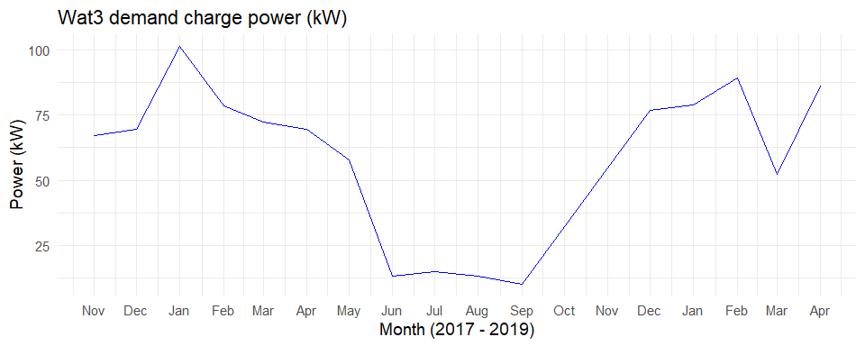<!-- -->

### Density of maximum peak power (kW)

<!-- -->

### Prediction performance for the last 3 months

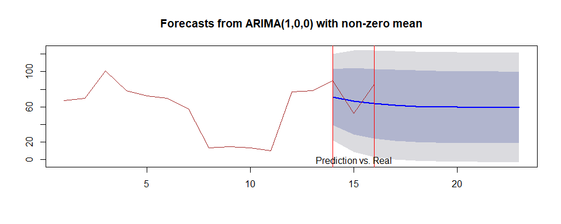<!-- -->

# Forecast based on day

For the comparison, forecastes based on day, were also plotted. The range between the upper and lower bound of forecast shows narrower than the one based on month. 

## PQ

### Daily maximum peak power(kW) trend

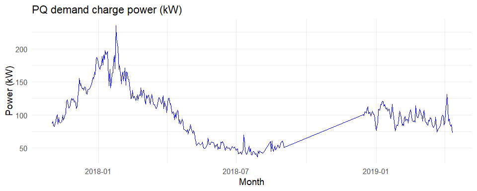<!-- -->

### Density of maximum peak power (kW)

<!-- -->

### Prediction performance for the last 10 days

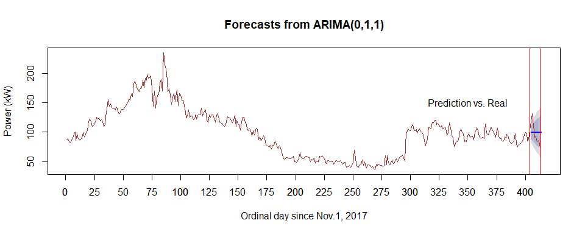<!-- -->

## Wat1

### Daily maximum peak power(kW) trend

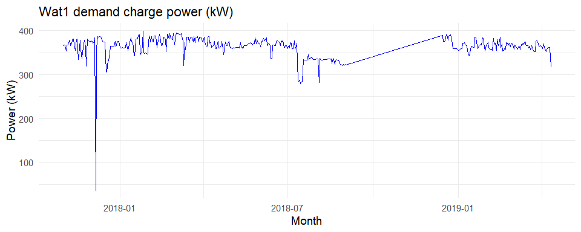<!-- -->

### Density of maximum peak power (kW)

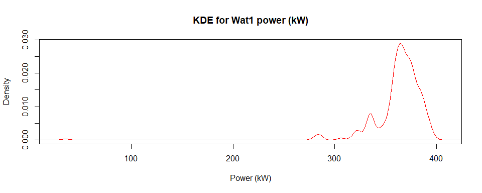<!-- -->

### Prediction performance for the last 10 days

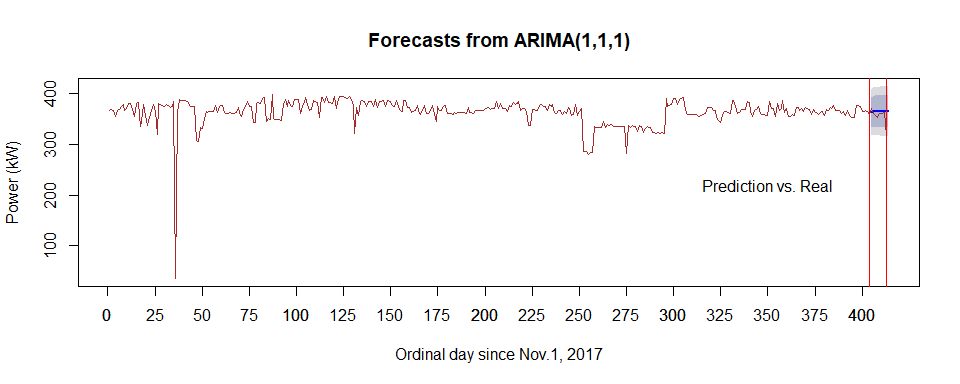<!-- -->

## Wat2

### Daily maximum peak power(kW) trend

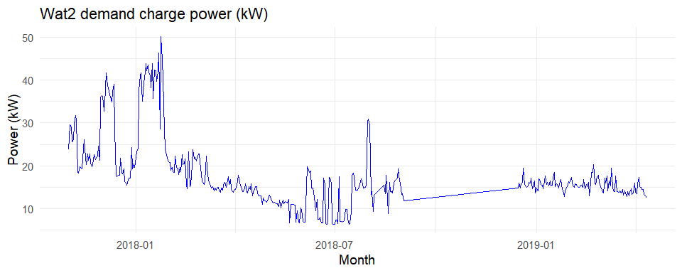<!-- -->

### Density of maximum peak power (kW)

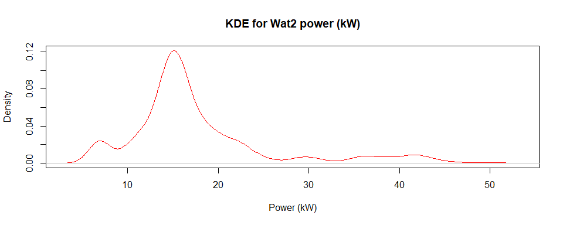<!-- -->

### Prediction performance for the last 10 days

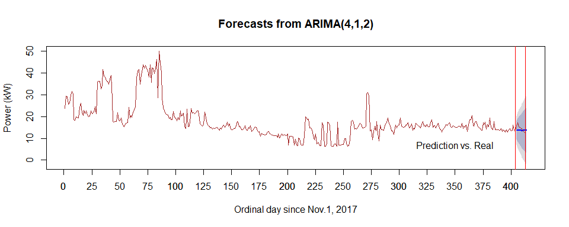<!-- -->

## Wat3

### Daily maximum peak power(kW) trend

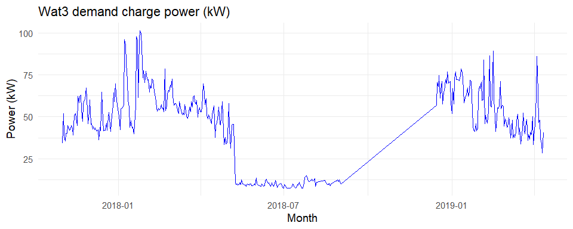<!-- -->

### Density of maximum peak power (kW)

<!-- -->

### Prediction performance for the last 10 days

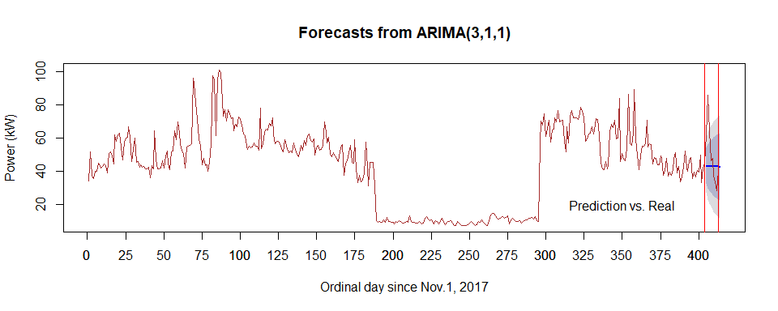<!-- -->
