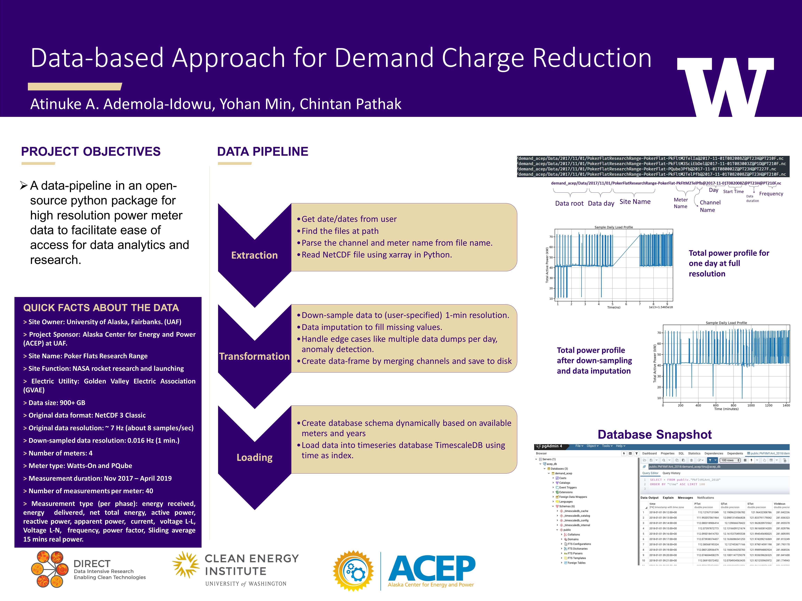

.. demand_acep documentation master file, created by
   sphinx-quickstart on Tue Mar 19 22:53:55 2019.
   You can adapt this file completely to your liking, but it should at least
   contain the root `toctree` directive.

demand_acep
===========

.. toctree::
   :maxdepth: 3
   :caption: Contents:

Introduction
------------
The project `demand_acep`_
aims to make sense of the data collected by power meters at some facilities at the
`Poker Flat Research Range`_ (PFRR) managed by `Alaska Center of Energy and Power`_ (ACEP).
The project resulted in an open-source Python 3 package, that implements a data pipeline for high
resolution power meter data to easy access to data for data analytics and research.
The quick overview of the data pipeline can be seen below:

About the data pipeline
------------------------
The data pipeline comprises of three steps:

* **Extract**: This steps takes the data from NetCDF files and creates a dataframe with time as index and values in the NetCDF file as the only column.

* **Transform**: This step takes the extracted data in the dataframe for each channel and down-samples the data to a lower resolution (1 minute default) and concatenates other channels to the dataframe keeping the same time index for each meter. The transformation step also does data imputation, i.e. fills in  the missing values. This implementation of extraction and transformation is coupled and happens in the function `extract_csv_for_date()`_, which saves the transformed data into a csv for each year. This function also handles edge-cases like days when data download to NetCDF files happens more than once. Data imputation handles two cases, i.e. when only few data points are missing versus when a longer time period, i.e. more than three consecutive data-points are missing. *This function does not handle cases when data is missing for a day or more.* An example extraction and transformation for a day is shown in the jupyter notebook `extract_to_csv.ipynb`_. An extraction and transformation for multiple days can be done in parallel and is shown in jupyter notebook `test_multiprocessing_csv.ipynb`_. The extraction, transformation and saving of down-sampled data to csv currently takes around 2h 10min on a 28 core, 2.4 GHz system.

* **Load**: This step takes the transformed data in csv files and copies it into the timeseries database - `TimescaleDB`_. TimescaleDB `installation instructions for Ubuntu`_ are pretty straightforward and it is incredibly straightforward to use with docker, like so:

.. code-block:: bash

   sudo docker run -d -e POSTGRES_USER=<username> -e POSTGRES_PASSWORD=<password> --name <database_name> -p 5432:5432  --restart=always timescale/timescaledb

Then create a database named :code:`demand_acep` and enable the TimescaleDB extension as described in the `getting started`_ section of the TimescaleDB docs. The database schema for insertion (copy) can be created using the function `create_db_schema_from_source_files()`_ which **deletes** all the existing data and tables and creates tables for each meter for each year, with channels as columns and time as primary key. Further, "copy" operation is preferred over the "insert" since it is much faster and can be done for full resolution data too efficiently (Read `here`_ about the risks and care in using copy over insert in postgresql database). Further, a Go utility `timescaledb-parallel-copy`_ is used to copy the data to the database in parallel. The function `parallel_copy_data_for_date()`_ prepares the command for timescaledb-parallel-copy and copies the data. This command is run with the "skip-header" option to ignore the first line of each day csv file, as that date-time is repeated with the previous day. Function `parallel_copy_data_for_dates()`_ is a wrapper around the `parallel_copy_data_for_date()`_ function and does the copying for a date range. An example application of the copy operation can be seen in the jupyter notebook `timescale_parallel_copy.ipynb`_. The parallel copy takes 6min 18s on a 28 core, 2.4 GHz system.

About the power meters
----------------------
The data consists of 4 power meters. Three power meters are `WattsOnMk2`_ and one
meter is `PQube`_. The meter names and corresponding types are listed in `meter_names.txt`_
Each meter measures around 50 channels at a sub-second resolution. The channel names
and description can be found in `this file`_. These files will have to updated if there are any
changes to meter names or channels, like if more meters are added or more channels are being recorded.

Data Years
----------
At the time of this writing, the ACEP Power meter dataset had data from Nov 2017 to
Apr 2019. As data years increase, they need to be added to the `data years`_ file.
 

Data plots
----------
For each meter (PQ, Wat1, Wat2, and Wat3), there are four plots showing the power (kW) trends per years, months, weekdays and days to help comparing the trends (Nov. 2017 to Apr. 2019).

.. toctree::

    plot

Power (kW) correlation and forecast
-----------------------------------
These 4 meters have power (kW) correlated each other for the past 3 years. The correlations are various depending upon the comparisons. In general, power in `PQ` meter is mostly correlated with power in `Wat3`. This founding is interesting as the more correlated, the more dependency resulting in less effective to address load reduction of having a virtual meter, are expected. Using ARIMA, power trends of each meter were forecasted based on month, which is the billing cycle for demand charge. The power trends were plotted with maximum value of the peak power during the month because the peak power decides the billing cost. For the comparison, forecasts based on day, were also plotted. The range between the upper and lower bound of forecast shows narrower than the one based on month.

.. toctree::

    correlation

Indices and tables
==================

* :ref:`genindex`
* :ref:`modindex`
* :ref:`search`

.. _demand_acep: https://github.com/demand-consults/demand_acep
.. _Poker Flat Research Range: http://www.pfrr.alaska.edu/content/welcome-poker-flat
.. _Alaska Center of Energy and Power: http://acep.uaf.edu/
.. _WattsOnMk2: http://www.elkor.net/product/WattsOn
.. _PQube: https://www.powerstandards.com/product/pqube-classic/highlights/
.. _meter_names.txt: https://github.com/chintanp/demand_acep/blob/master/demand_acep/data/properties/meter_names.txt
.. _this file: https://github.com/chintanp/demand_acep/blob/master/demand_acep/data/properties/NetCDF%20Meter%20File%20Generation%20Matrix%20Copy%20Poker%20Flats.xlsx
.. _data years: https://github.com/demand-consults/demand_acep/blob/master/demand_acep/data/properties/data_years.txt
.. _extract_csv_for_date(): https://github.com/demand-consults/demand_acep/blob/f1d08e274b4bc9506cdcf7417191f705ab0a0ce4/demand_acep/extract_data_to_csv.py#L20
.. _timescaledb-parallel-copy: https://github.com/timescale/timescaledb-parallel-copy
.. _create_db_schema_from_source_files(): https://github.com/demand-consults/demand_acep/blob/f1d08e274b4bc9506cdcf7417191f705ab0a0ce4/demand_acep/create_db_schema.py#L7
.. _extract_to_csv.ipynb: https://github.com/demand-consults/demand_acep/blob/master/scripts/extract_to_csv.ipynb
.. _test_multiprocessing_csv.ipynb: https://github.com/demand-consults/demand_acep/blob/master/scripts/test_multiprocessing_csv.ipynb
.. _parallel_copy_data_for_date(): https://github.com/demand-consults/demand_acep/blob/f1d08e274b4bc9506cdcf7417191f705ab0a0ce4/demand_acep/timescale_parallel_copy.py#L18
.. _here: https://www.postgresql.org/docs/9.4/populate.html
.. _timescale_parallel_copy.ipynb: https://github.com/demand-consults/demand_acep/blob/master/scripts/timescale_parallel_copy.ipynb
.. _parallel_copy_data_for_dates(): https://github.com/demand-consults/demand_acep/blob/f1d08e274b4bc9506cdcf7417191f705ab0a0ce4/demand_acep/timescale_parallel_copy.py#L81
.. _getting started: https://docs.timescale.com/v1.3/getting-started/setup
.. _TimescaleDB: https://www.timescale.com/
.. _installation instructions for Ubuntu: https://docs.timescale.com/v1.3/getting-started/installation/ubuntu/installation-apt-ubuntu
