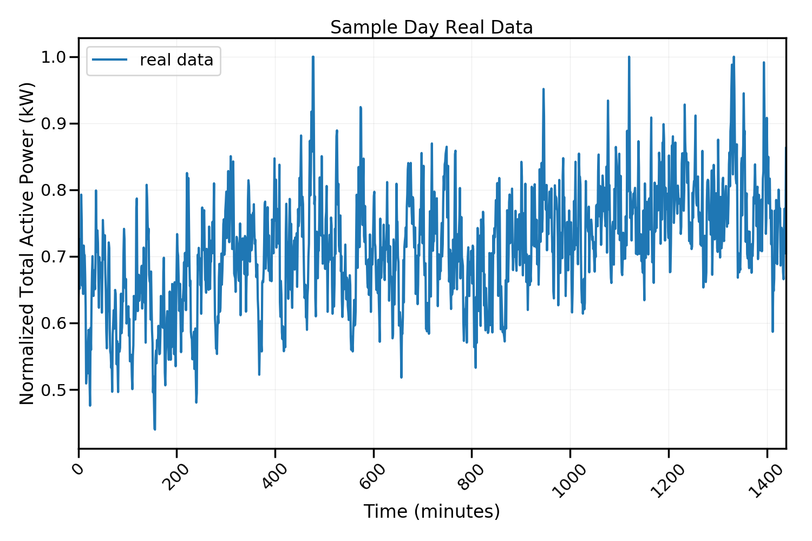
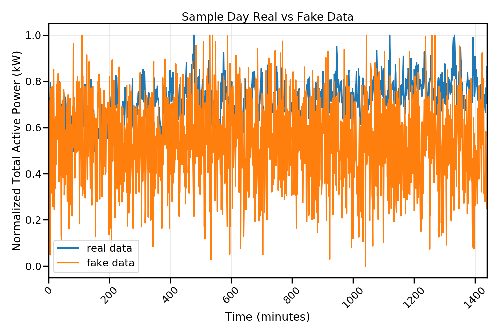

.. _load_synthesis:

=======================
Load Synthesis
=======================

The benefits of having the data in an accessible form provided by the data pipeline is the ease of using the data for various analysis. Some potential analysis such as evaluating the energy storage potentials requires a large amount of data which is not available as the ACEP measurement data is ranges from November 2017 to March 2019. 

One way of mitigating this problem is to create synthetic load profiles, that is, load profiles which have similar structures to the actual data. A common way of generating synthetic data is using a method called generative adversarial network (GAN). 

Unfortunately, the performance of GAN on the ACEP measurement data was quite poor. A possible reason for this could be due to the nature and structure of the measurement data as seen in the figure below. The data does not follow a particular time series trend and spikes at irregular intervals, which makes it difficult for the generator to produce a look-alike data set that can pass the discriminators test.

**Sample Day Data.**

**Sample Day Data and Synthesized Data.**

The code used in generating the results above can be found in `load_synthesis.ipynb`_

.. _load_synthesis.ipynb: https://github.com/demand-consults/demand_acep/blob/master/scripts/test_data_impute.ipynb 